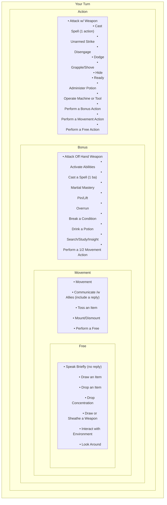

<!--
```mermaid
flowchart TD
    A[Is the Character's intent vs the environment, object, or motive inherently or purposefully challenging?]
    A --\>|No| B[Roleplay success]
    A --\>|Yes| C[Is the Character's intent likely within their basic 'wheel house'?]
    C --\>|Yes| D[Roleplay success]
    C --\>|No| E[Set a DC for an Ability Check, Save, or Attack Roll]
    E --\> F[Are the character's passives equal to or higher than the DC?]
    F --\>|Yes| G[Roleplay success]
    F --\>|No| H[Player rolls dice, adjust score vs DC to determine result]
    H --\>|Roll is equal to or higher than DC| I[Roleplay success]
    H --\>|Roll is lower than DC| J[Roleplay setback]
```
-->

<!--

-->