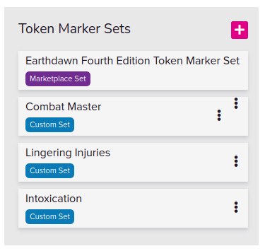

# New Game Checklist

## Adjust the Token Markers

These markers will be used by players and Combat Master (api) to mark status affects on characters.

## Add Game and Looking For Group Descriptions

The markdown for the game descriptions is very limited. Use the template under `templates` / `campaign-details`.

Then edit the `game-description` to a more concise version for LFG post.

## Add Forum Posts

When adding forum posts use the markdown templates. However instead of copy-pasting the markdown, Render the markdown in the VS Code previewer and copy-paste the rendered version. This will retain images and styling in the forum post.

Some Markdown documents may contain too much data to be successfully saved in one Forum Post. Break these up into one main post and subsequent replies.

Close and make sticky the following order:
Here’s the reversed order of your list:

1. Apply Here (Only in LFG)  
2. Character Introductions (open)  
3. Dungeon Master Introduction (open)  
4. House Rules and Modifications (In LFG As well)  
5. Important Links**

## Game Settings

